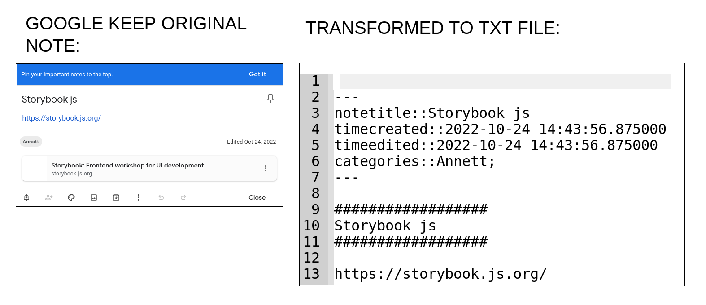

# googleKeepToSimplenote

## README
* This transforms Google Keep notes to txt files
that can be imported to Simplenote and probably other editors.

### Guide:
1. Place all Google Keep notes in the folder keepNotes.
2. Run the file googleKeepToSimplenote.py
3. Finished 

### Important
* You should have Python 3 installed.
* This is tested on Ubuntu 20.04 operating system. It is only tested on keep notes that contains only text. The program has not been tested on keep notes that contains media like images, sound recordings and videos.
